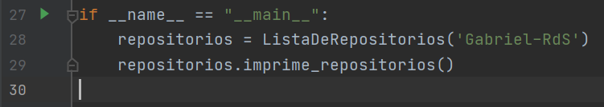
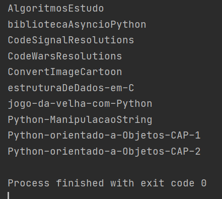

# Consumindo a API do Github em Python

_`Neste repositório conseguimos acessar o nome dos repositórios de qualquer
usuáiro do github, apenas inserindo seu nickname, conforme nas linhas abaixo, onde eu insiro meu nickname:`_

`Output:`

